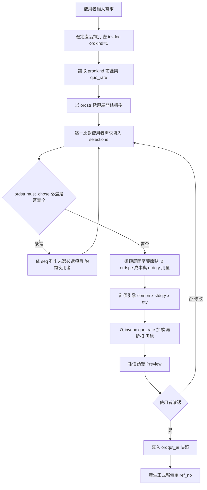

# 改善後完整報價流程（含 invdoc / ordstr）

> 本文件描述導入 `invdoc`（產品類別主檔）與 `ordstr`（產品結構／必選項目樹）之後的完整報價流程。
>
> **核心改善**：報價不再只依賴使用者自然語言 + `rule_parser` 拼湊 `selections`，而是先由 `invdoc` 選定產品類別、由 `ordstr` 展開該產品的「完整結構樹與必選項目」，逐一補齊選擇，再由 `ordspe` 取成本、`ordqty` 取用量，確保報價結構完整、不漏項。

---

## 1. 兩張新資料表的角色

| 資料表 | 角色 | 回答的問題 |
|---|---|---|
| `invdoc` | 產品類別主檔（`ordkind=1`） | 「系統有哪些產品類別？名稱與報價率是什麼？」 |
| `ordstr` | 產品結構／必選項目樹（父子邊表） | 「一個節點底下有哪些子節點？哪些是必選？顯示順序為何？」 |

### 1.1 invdoc — 產品類別主檔

實際 DDL（PK `workgroup + prodkind`）：

| 欄位 | 型態 | Null | 說明 |
|---|---|---|---|
| `workgroup` | nchar(3) | N | 事業別（PK）；本案例為 `103` |
| `prodkind` | nchar(12) | N | 產品類別代碼（PK），對應 `ordstr.pathf` / `ordspe.path` 的前綴（如 `CMT1`） |
| `codsc` | nchar(30) | Y | 產品類別名稱（如「辦公桌」） |
| `ordkind` | nchar(1) | Y | 類別種類；**報價產品類別以 `ordkind = 1` 篩選** |
| `quo_rate` | float | Y | **報價率／加成率**，可取代目前寫死於 `config.py` 的 `MARKUP_RATE` |
| `adddate` / `addusrno` / `abndat` / `abntim` / `usrno` / `prgno` | char | Y | 稽核欄位 |

用途：報價開始時以 `ordkind=1`、`workgroup=103` 查出可報價的產品類別清單；使用者選定 `prodkind`（如 `CMT1`）後，即得到：
- 產品前綴（取代寫死的 `PRODUCT_PREFIX`）。
- 該產品類別的報價率 `quo_rate`（取代寫死的 `MARKUP_RATE`）。

### 1.2 ordstr — 產品結構／必選項目樹

實際 DDL（PK `workgroup + pathf + pathc`，為**父子鄰接邊表 adjacency list**）：

| 欄位 | 型態 | Null | 說明 |
|---|---|---|---|
| `workgroup` | nchar(3) | N | 事業別（PK） |
| `pathf` | nchar(100) | N | **父節點路徑**（PK），如 `CMT1\A001` |
| `pathc` | nchar(100) | N | **子節點路徑**（PK），如 `CMT1\A001\S005` |
| `optnof` | nchar(10) | N | 父節點選項代碼 |
| `optnoc` | nchar(10) | N | 子節點選項代碼 |
| `must_chose` | nchar(1) | Y | **是否必選**（如 `Y`/`N`）— 必選項目完整性檢查的權威來源 |
| `has_name` | nchar(1) | Y | 子節點是否有名稱 |
| `has_inname` | nchar(1) | Y | 是否有內部名稱 |
| `seq` | int | Y | 同一父節點下子項目的**顯示順序** |
| `dmark` | ntext | Y | 備註／說明 |
| `adddate` / `addusrno` / `usrno` / `prgno` / `abndat` / `abntim` | char | Y | 稽核欄位 |

**關鍵特性**：
- `ordstr` 是**邊表**：每一列代表「父 `pathf` → 子 `pathc`」的一條邊。要展開整棵樹需以 `pathf` 遞迴查詢。
- **父階層**（結構節點）：本身無成本，僅作分類（如 `CMT1\A001\S005` 顏色材質群組）。
- **子階層**（計價節點）：實際成本來自 `ordspe.compri`；用量來自 `ordqty.stdqty`。
- **有成本的子項目可能在 2 階以上**（如 `CMT1\A001\S050\S005\S008`），須沿樹遞迴展開到葉節點，再回 `ordspe` / `ordqty` 取值。
- `must_chose = Y` 的節點是「必選項目」，缺選時必須詢問使用者。

> [`logs/ss.txt`](../logs/ss.txt) 中的報價單 `QU26824010-01001` 即是一張「依 ordstr 展開後」的完整實例，可作為結構驗證樣本。

---

## 2. 樹狀結構範例（依 ordstr 邊表展開，資料取自 QU26824010-01001）

```text
CMT1\A001                     桌面尺寸 (父,結構)        code=C005 60*180   compri=0
├─ CMT1\A001\S004             板材 (子,計價)            25mm MDF           compri=700
├─ CMT1\A001\S005             顏色材質 (父,結構)                            compri=0
│   ├─ CMT1\A001\S005\S001    表板色紙 (子,計價)        817胡桃木          compri=513
│   └─ CMT1\A001\S005\S007    底板色紙 (子,計價)        MDF貼胡桃色紙      compri=240
├─ CMT1\A001\S015             面漆 (子,計價)            胡桃漆             compri=500
├─ CMT1\A001\S019             (父,結構)                                    compri=0
│   └─ CMT1\A001\S019\S020    (子,計價)                40*13.5 銀鋁單掀    compri=800
├─ CMT1\A001\S050             (父,結構)                置中               compri=0
│   └─ CMT1\A001\S050\S005    (父,結構,第2階)                              compri=0
│       └─ CMT1\A001\S050\S005\S008  (子,計價,第3階)   4*8*3mm MDF胡桃紙   compri=140  ← 成本子項在 2 階以上
├─ CMT1\A001\S061             螺絲 (子,計價)                               compri=100
└─ CMT1\A001\W001             工費 (父,結構)                               compri=0
    ├─ CMT1\A001\W001\W010    裁切 compri=150
    ├─ CMT1\A001\W001\W020    貼合 compri=300
    ├─ CMT1\A001\W001\W030    木工 compri=100
    ├─ CMT1\A001\W001\W040    噴漆 compri=500
    └─ CMT1\A001\W001\W050    包裝 compri=300

CMT1\B001                     木腳 (父,結構)            45寬環式腳         compri=0
├─ CMT1\B001\S004             纖維板 compri=480
├─ CMT1\B001\S005\S008        胡桃紙 (2階) compri=140
└─ CMT1\B001\W001\W0xx        木腳工費 compri=...
```

判別規則：

- 在 `ordstr` 中作為 `pathf` 出現且底下有子節點 → **父結構節點**（維持樹完整，本身不計價）。
- 葉節點（不再作為 `pathf`）且 `ordspe.compri > 0` → **計價子項**（實際成本來源）。
- `must_chose = Y` → **必選項目**，缺選必須詢問。
- 計價子項的 `stdqty` 由 `ordqty` 以「驅動根節點所選代碼」查詢（沿用現行 [`engine/calculator.py`](../engine/calculator.py) 已驗證規則）。

---

## 3. 改善後報價流程（端到端）



### 流程步驟說明

1. **選定產品類別**：查 `invdoc`（`ordkind=1`、`workgroup=103`）取得可報價的產品類別清單與名稱 `codsc`；使用者選定 `prodkind`（如 `CMT1`）。
2. **讀取產品參數**：由選定的 `invdoc` 列取得產品前綴（`prodkind`）與報價率（`quo_rate`）。
3. **展開結構樹**：以 `ordstr` 從根節點（`pathf = {prodkind}\{根 optno}`）遞迴向下展開所有 `pathc`，建立完整結構骨架。
4. **填入使用者選擇**：以 `rule_parser` / LLM 解析結果對照 `ordstr` 骨架，逐一將需求填入對應節點。
5. **必選項目完整性檢查**：以 `ordstr.must_chose = Y` 為權威來源檢查缺項（取代目前僅靠 `config.REQUIRED_OPTNOS` 的粗略檢查）。缺項時依 `seq` 排序列出並詢問。
6. **展開成本子項**：沿樹遞迴至葉節點，對每個計價子項查 `ordspe.compri` 取成本、以驅動根節點所選代碼查 `ordqty` 取 `stdqty` / `stdpar`。
7. **計價**：`compri × stdqty × qty` → 以 `invdoc.quo_rate` 加成 → 折扣 → 稅。
8. **預覽與確認**：使用者確認後寫入 `ordqdt_ai` 快照，保存當時成本、用量、規格、報價率。

---

## 4. 與現行流程的差異對照

| 項目 | 現行流程 | 改善後流程 |
|---|---|---|
| 產品類別來源 | 寫死 `PRODUCT_PREFIX=CMT1` | 由 `invdoc`（`ordkind=1`）動態載入 `prodkind` / `codsc` |
| 加成率來源 | 寫死 `config.MARKUP_RATE` | 由 `invdoc.quo_rate` 依產品類別動態取得 |
| 必選項目定義 | `config.REQUIRED_OPTNOS`（粗略，僅根節點） | 由 `ordstr.must_chose` 定義完整必選項目 |
| 結構完整性 | 依賴 `rule_parser` 是否解析到 | 由 `ordstr` 邊表遞迴保證樹完整展開 |
| 完整性檢查 | 檢查 `REQUIRED_OPTNOS` 是否在 `selections` | 依 `ordstr` 逐節點檢查必選是否齊全 |
| 成本子項展開 | 依賴 rule_parser 是否解析到 | 由 `ordstr` 樹遞迴保證展開，`ordspe`/`ordqty` 補成本與用量 |
| 選項顯示順序 | 無明確排序 | 依 `ordstr.seq` 排序 |
| 漏項風險 | 高（使用者沒提到就不計價） | 低（樹結構強制補齊必選項目） |

---

## 5. 資料關係總覽（更新後）

```text
invdoc (產品類別主檔, ordkind=1)
  │  prodkind (產品前綴) + quo_rate (報價率)
  ▼
ordstr (產品結構樹, 父子邊表 pathf→pathc, must_chose)
  │  遞迴展開至葉節點
  ├──────────────┐
  ▼              ▼
ordspe          ordqty
可選項目/成本    部件用量
(compri)        (stdqty)
  └──────┬───────┘
         ▼
   calculate_from_draft() 以 quo_rate 加成
         ▼
   ordqdt_ai (報價快照)
```

---

## 6. 待後續程式實作事項

詳細的 Model 定義、Repository 函式、Calculator 改動與各檔案修改點，請參考修改清單：
[`plans/新增invdoc-ordstr-報價流程改善.md`](../plans/新增invdoc-ordstr-報價流程改善.md)
